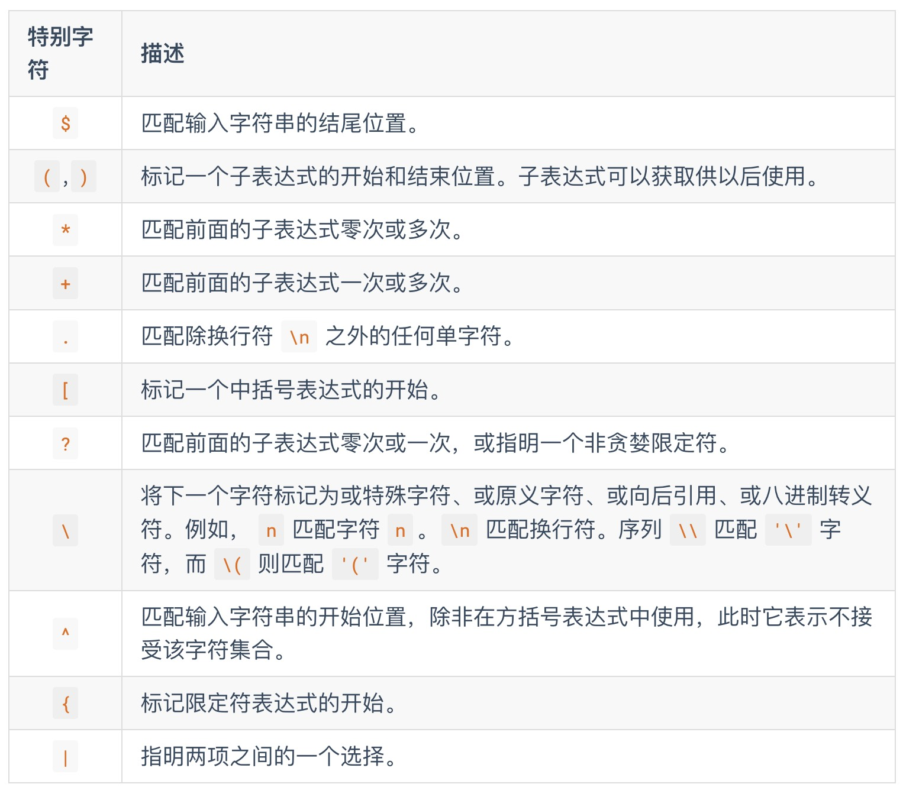
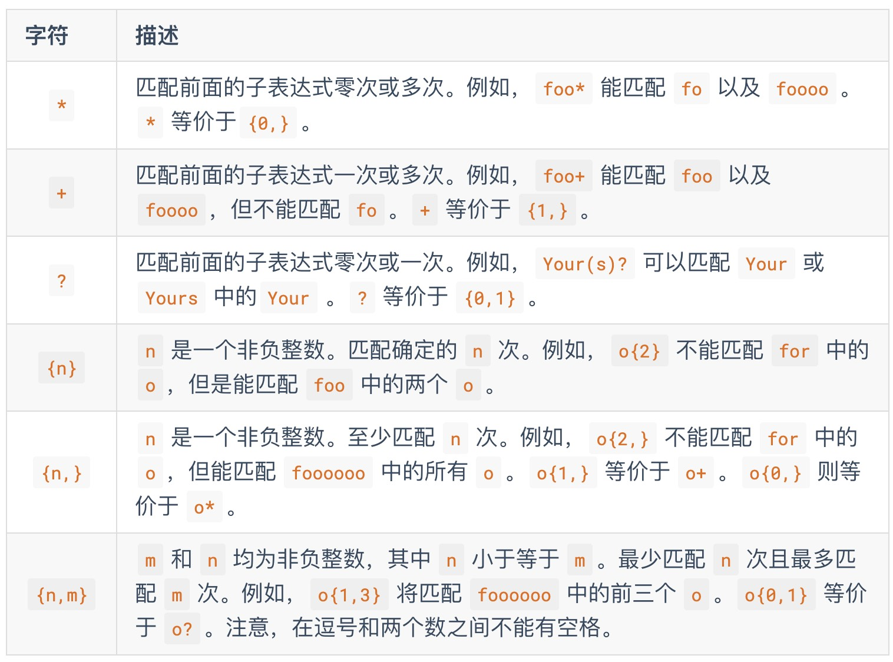

# 6.1 正则表达式简介

正则表达式不是 C++ 语言的一部分，这里仅做简单的介绍。

正则表达式描述了一种字符串匹配的模式。一般使用正则表达式主要是实现下面三个需求：

1. 检查一个串是否包含某种形式的子串；
2. 将匹配的子串替换；
3. 从某个串中取出符合条件的子串。

正则表达式是由普通字符（例如 a 到 z）以及特殊字符组成的文字模式。模式描述在搜索文本时要匹配的一个或多个字符串。 正则表达式作为一个模板，将某个字符模式与所搜索的字符串进行匹配。

## 普通字符
普通字符包括没有显式指定为元字符的所有可打印和不可打印字符。这包括所有大写和小写字母、所有数字、所有标点符号和一些其他符号。

## 特殊字符
特殊字符是正则表达式里有特殊含义的字符，也是正则表达式的核心匹配语法。参见下表：


## 限定符
限定符用来指定正则表达式的一个给定的组件必须要出现多少次才能满足匹配。见下表：

有了这两张表，我们通常就能够读懂几乎所有的正则表达式了。

# 6.2 std::regex 及其相关
对字符串内容进行匹配的最常见手段就是使用正则表达式。 可惜在传统 C++ 中正则表达式一直没有得到语言层面的支持，没有纳入标准库， 而 C++ 作为一门高性能语言，在后台服务的开发中，对 URL 资源链接进行判断时， 使用正则表达式也是工业界最为成熟的普遍做法。

一般的解决方案就是使用 boost 的正则表达式库。 而 C++11 正式将正则表达式的的处理方法纳入标准库的行列，从语言级上提供了标准的支持， 不再依赖第三方。

C++11 提供的正则表达式库操作 std::string 对象， 模式 std::regex (本质是 std::basic_regex)进行初始化， 通过 std::regex_match 进行匹配， 从而产生 std::smatch （本质是 std::match_results 对象）。

我们通过一个简单的例子来简单介绍这个库的使用。考虑下面的正则表达式:

- [a-z]+\.txt: 在这个正则表达式中, [a-z] 表示匹配一个小写字母, + 可以使前面的表达式匹配多次， 因此 [a-z]+ 能够匹配一个小写字母组成的字符串。 在正则表达式中一个 . 表示匹配任意字符，而 \. 则表示匹配字符 .， 最后的 txt 表示严格匹配 txt 则三个字母。因此这个正则表达式的所要匹配的内容就是由纯小写字母组成的文本文件。

std::regex_match 用于匹配字符串和正则表达式，有很多不同的重载形式。 最简单的一个形式就是传入 std::string 以及一个 std::regex 进行匹配， 当匹配成功时，会返回 true，否则返回 false。例如：
```C++
#include <iostream>
#include <string>
#include <regex>

int main() {
    std::string fnames[] = {"foo.txt", "bar.txt", "test", "a0.txt", "AAA.txt"};
    // 在 C++ 中 \ 会被作为字符串内的转义符，
    // 为使 \. 作为正则表达式传递进去生效，需要对 \ 进行二次转义，从而有 \\.
    std::regex txt_regex("[a-z]+\\.txt");
    for (const auto &fname: fnames)
        std::cout << fname << ": " << std::regex_match(fname, txt_regex) << std::endl;
}
```
另一种常用的形式就是依次传入 std::string/std::smatch/std::regex 三个参数， 其中 std::smatch 的本质其实是 std::match_results。 故而在标准库的实现中， std::smatch 被定义为了 std::match_results<std::string::const_iterator>， 也就是一个子串迭代器类型的 match_results。 使用 std::smatch 可以方便的对匹配的结果进行获取，例如：

```C++
std::regex base_regex("([a-z]+)\\.txt");
std::smatch base_match;
for(const auto &fname: fnames) {
    if (std::regex_match(fname, base_match, base_regex)) {
        // std::smatch 的第一个元素匹配整个字符串
        // std::smatch 的第二个元素匹配了第一个括号表达式
        if (base_match.size() == 2) {
            std::string base = base_match[1].str();
            std::cout << "sub-match[0]: " << base_match[0].str() << std::endl;
            std::cout << fname << " sub-match[1]: " << base << std::endl;
        }
    }
}
```
以上两个代码段的输出结果为：
```C++
foo.txt: 1
bar.txt: 1
test: 0
a0.txt: 0
AAA.txt: 0
sub-match[0]: foo.txt
foo.txt sub-match[1]: foo
sub-match[0]: bar.txt
bar.txt sub-match[1]: bar
```

# 习题
在 Web 服务器开发中，我们通常希望服务某些满足某个条件的路由。正则表达式便是完成这一目标的工具之一。

给定如下请求结构：
```C++
struct Request {
    // request method, POST, GET; path; HTTP version
    std::string method, path, http_version;
    // use smart pointer for reference counting of content
    std::shared_ptr<std::istream> content;
    // hash container, key-value dict
    std::unordered_map<std::string, std::string> header;
    // use regular expression for path match
    std::smatch path_match;
};
```
请求的资源类型：
```C++
typedef std::map<
    std::string, std::unordered_map<
        std::string,std::function<void(std::ostream&, Request&)>>> resource_type;
```
以及服务端模板：
```C++
template <typename socket_type>
class ServerBase {
public:
    resource_type resource;
    resource_type default_resource;

    void start() {
        // TODO
    }
protected:
    Request parse_request(std::istream& stream) const {
        // TODO
    }
}
```

请实现成员函数 start() 与 parse_request。使得服务器模板使用者可以如下指定路由：
```C++
template<typename SERVER_TYPE>
void start_server(SERVER_TYPE &server) {

    // process GET request for /match/[digit+numbers],
    // e.g. GET request is /match/abc123, will return abc123
    server.resource["fill_your_reg_ex"]["GET"] =
        [](ostream& response, Request& request)
    {
        string number=request.path_match[1];
        response << "HTTP/1.1 200 OK\r\nContent-Length: "
                 << number.length() << "\r\n\r\n" << number;
    };

    // peocess default GET request;
    // anonymous function will be called
    // if no other matches response files in folder web/
    // default: index.html
    server.default_resource["fill_your_reg_ex"]["GET"] =
        [](ostream& response, Request& request)
    {
        string filename = "www/";

        string path = request.path_match[1];

        // forbidden use `..` access content outside folder web/
        size_t last_pos = path.rfind(".");
        size_t current_pos = 0;
        size_t pos;
        while((pos=path.find('.', current_pos)) != string::npos && pos != last_pos) {
            current_pos = pos;
            path.erase(pos, 1);
            last_pos--;
        }

        // (...)
    };

    server.start();
}
```
